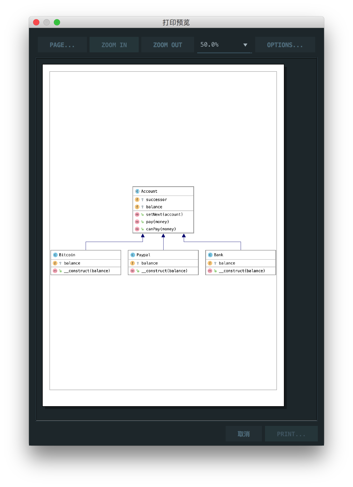

# 责任链模式

> It helps building a chain of objects. Request enters from one end and keeps going from object to object till it finds the suitable handler.

责任链模式有助于构建一系列对象。请求从一端进入并继续从一个对象到另一个对象，直到它找到合适的处理程序。

## 楼主说

责任链模式就是说把几个类似的类连在一起，使用递归依次调用，直到有一个类成功

## UML

