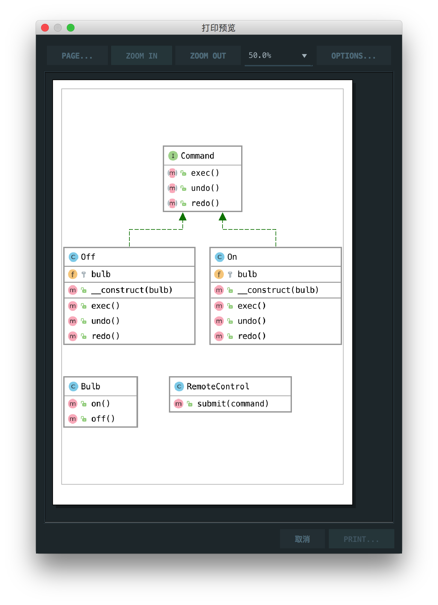

# 命令行模式

> Allows you to encapsulate actions in objects. The key idea behind this pattern is to provide the means to decouple client from receiver.

允许您将操作封装在对象中。这种模式背后的关键思想是提供将客户端与接收器分离的方法。

## 楼主说

命令行模式就如它名字一样，提供一条命令，命令的接收者封装了对应的执行方法，个人理解比外观模式封装更进一层

## UML

