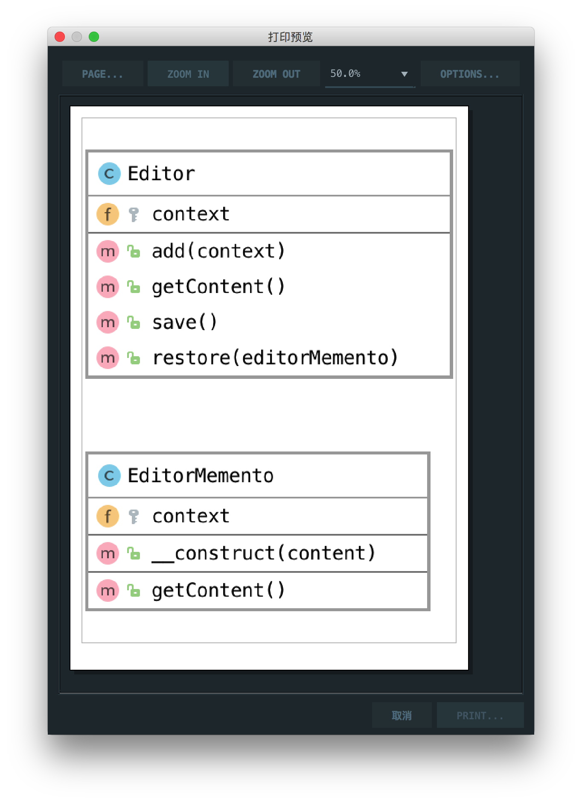

# 备忘录模式

> Memento pattern is about capturing and storing the current state of an object in a manner that it can be restored later on in a smooth manner.

备忘录模式是关于以稍后可以以平滑方式恢复的方式捕获和存储对象的当前状态。

## 楼主说

备忘录模式就是可以存储类的一个状态，而且可以回退操作

## UML

