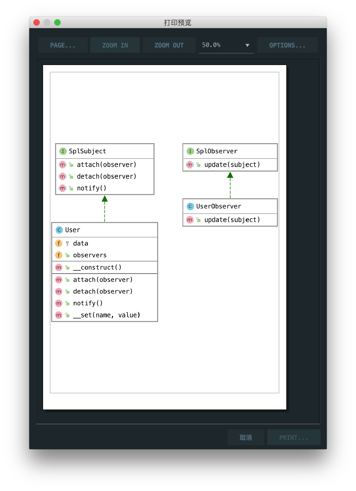

# 观察者模式

> Defines a dependency between objects so that whenever an object changes its state, all its dependents are notified.

观察者模式是定义对象之间的依赖关系，以便每当对象更改其状态时，都会通知其所有依赖项。

## 楼主说

观察者模式和发布订阅差不多，一个类负责订阅，一个类负责发布，当有新的发布内容就会通知到订阅者

## UML

