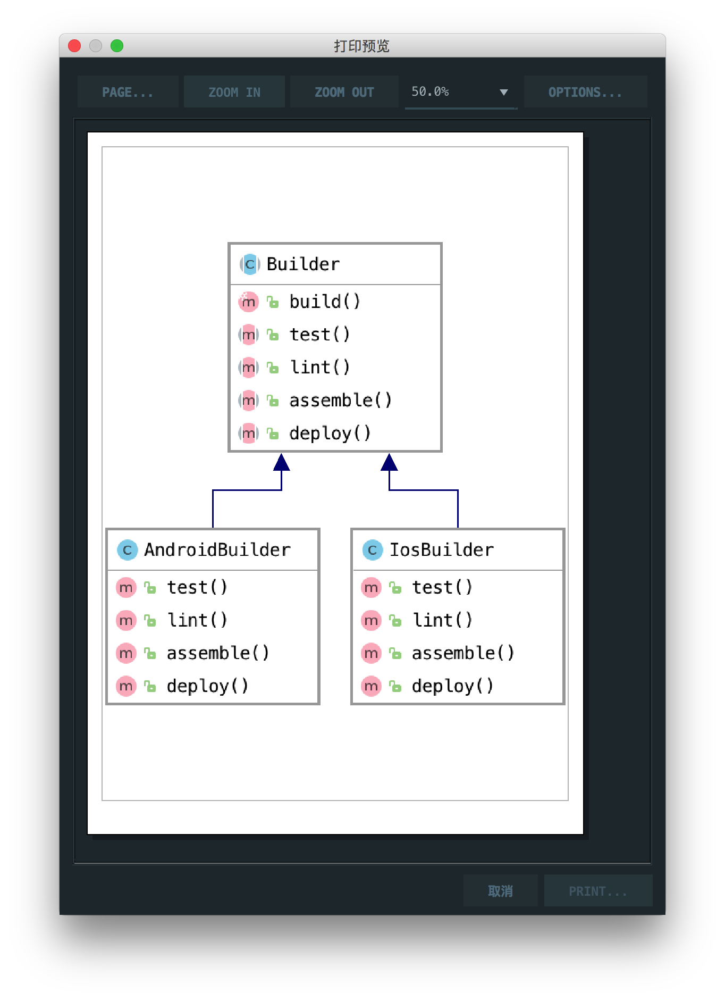

# 模板方法模式

> Template method defines the skeleton of how a certain algorithm could be performed, but defers the implementation of those steps to the children classes.

模板方法模式定义了如何执行某个算法的框架，但是将这些步骤的实现推迟到子类。

## 楼主说

模板方法模式有点像外观模式，用一个方法实现好几个方法

## UML

