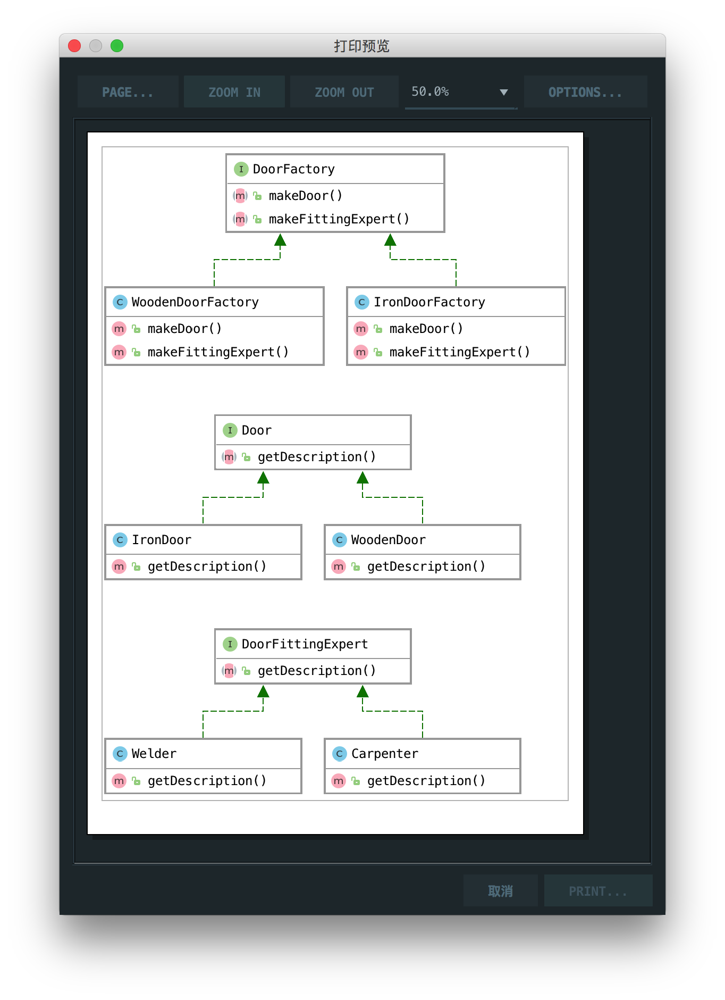

# 抽象工厂

> A factory of factories; a factory that groups the individual but related/dependent factories together without specifying their concrete classes.

工厂的工厂，工厂将个体进行分组，但把有关系/依赖的工厂组装在一起，并且不会指定它们的实例

## UML

