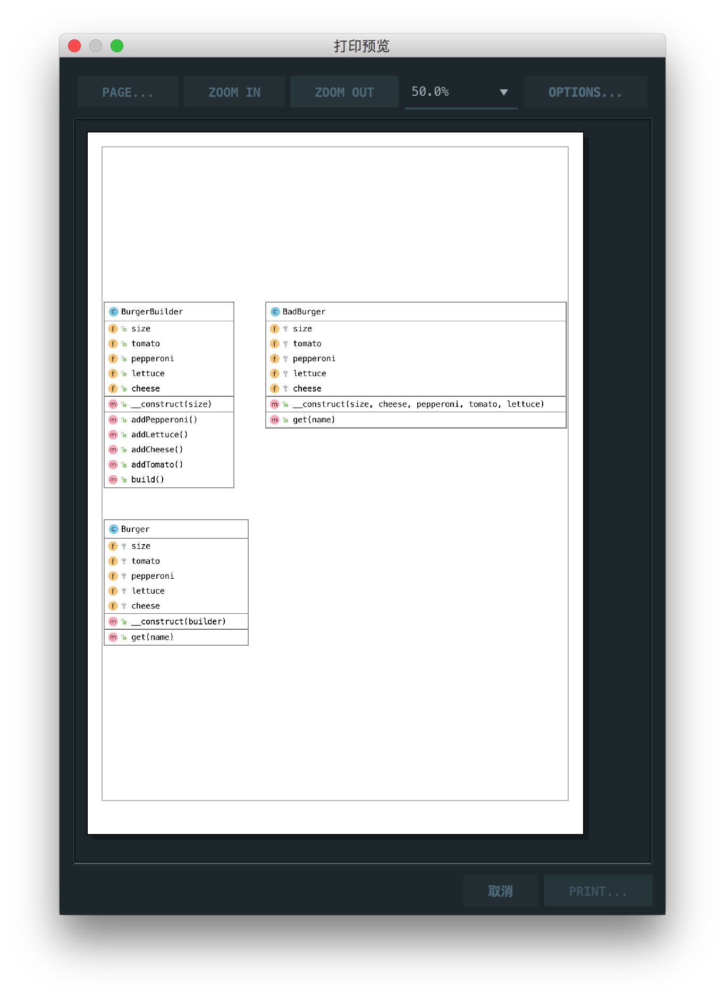

# 建造者模式

> Allows you to create different flavors of an object while avoiding constructor pollution. Useful when there could be several flavors of an object. Or when there are a lot of steps involved in creation of an object.

允许您创建不同风格的对象，同时避免构造函数污染。当有几种风格的对象时很有用。或者在创建对象时涉及很多步骤。

## 楼主说

建造者模式就是为了防止构造函数过于臃肿和不易阅读，注入一个构造器，给类进行DIY，加强易读性

## UML

