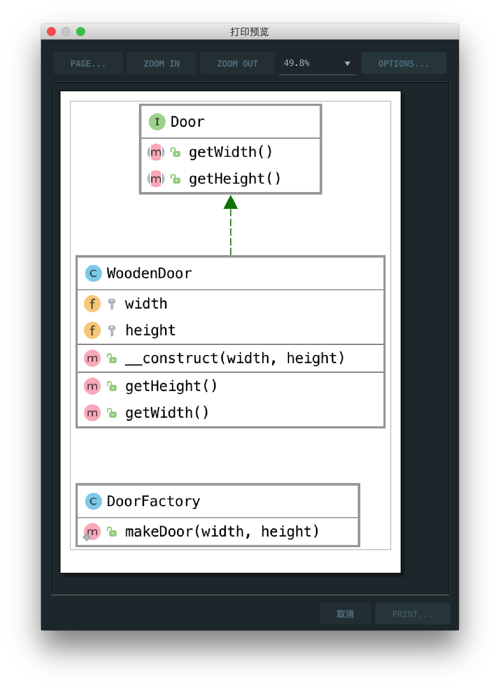

# 简单工厂

> Simple factory simply generates an instance for client without exposing any instantiation logic to the client

简单工厂为客户端生成实例，而不向客户端公开任何实例化逻辑

## 楼主说

简单工厂其实就是本来把实例化一个类换成了用工厂代替实例化，从而隐藏了具体的类

## UML

