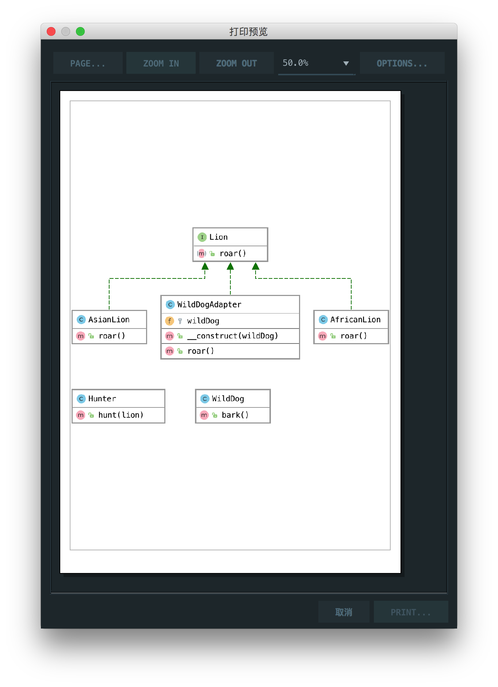

# 适配器模式

> Adapter pattern lets you wrap an otherwise incompatible object in an adapter to make it compatible with another class.

适配器模式是让你将其它不兼容的对象包装在适配器中，使得其兼容其它的类

## 楼主说

适配器模式就是通过适配器类将一个类的方法强行调包成其它的方法，以达到兼容的假象

## UML

