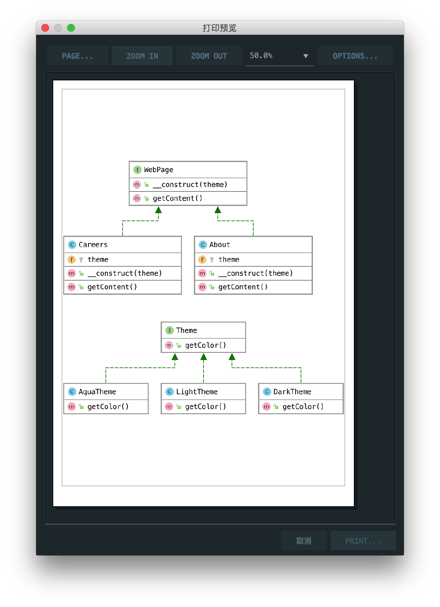

# 桥接模式

> Bridge pattern is about preferring composition over inheritance. Implementation details are pushed from a hierarchy to another object with a separate hierarchy.

桥接模式更倾向于组合而不是继承。实现细节从层次结构推送到具有单独层次结构的另一个对象。

## 楼主说

桥接模式就是类的组合，类似复杂度m*n变成m+n

## UML

