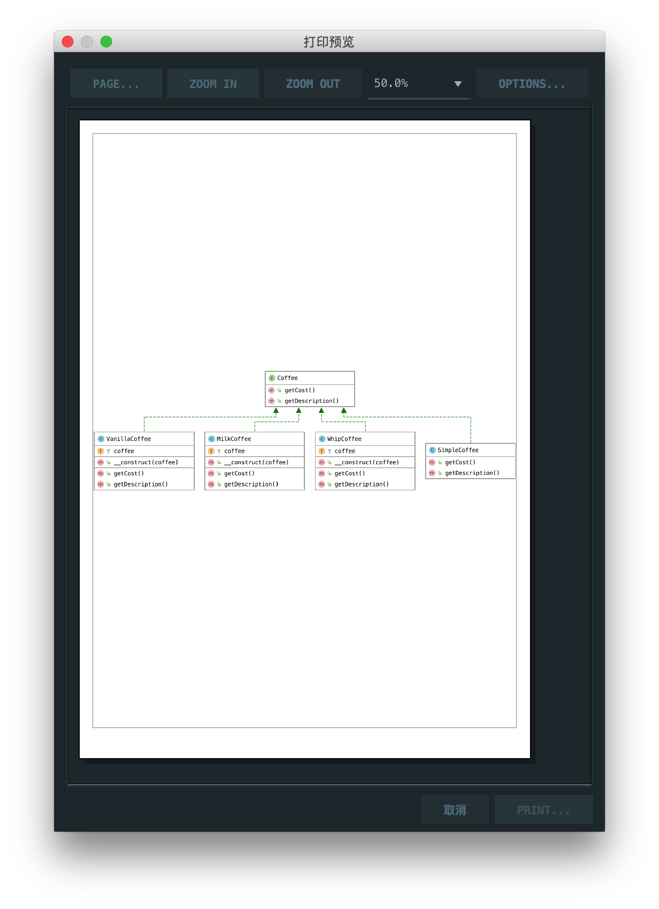

# 装饰器模式

> Decorator pattern lets you dynamically change the behavior of an object at run time by wrapping them in an object of a decorator class.

装饰器模式允许您通过将对象包装在装饰器类的对象中来动态更改对象在运行时的行为。

## 楼主说

装饰器模式就是给一个原始类进行动态添加修饰类

## UML

