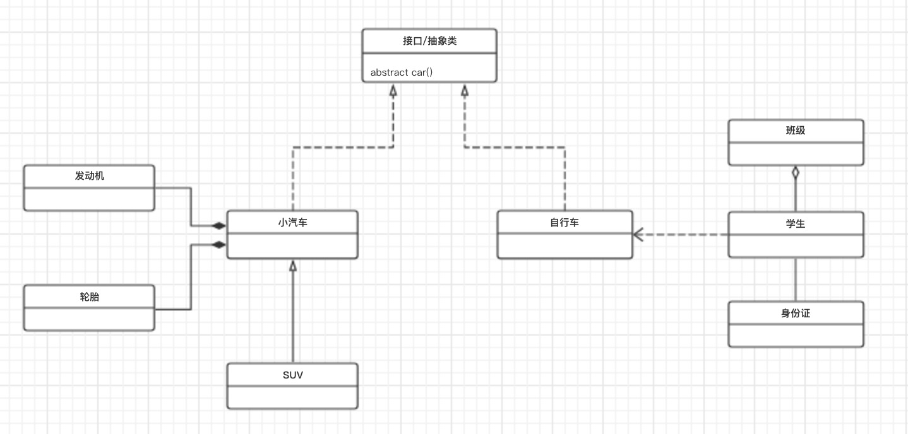

# 通俗易懂的设计模式总结

<!-- TOC -->

- [通俗易懂的设计模式总结](#通俗易懂的设计模式总结)
    - [一、什么是设计模式](#一什么是设计模式)
    - [二、设计模式的类型](#二设计模式的类型)
    - [三、设计模式的六大原则](#三设计模式的六大原则)
    - [四、UML类图](#四uml类图)
        - [1、看懂UML类图](#1看懂uml类图)
        - [2、解释](#2解释)
    - [五、使用](#五使用)
    - [六、测试](#六测试)
    - [七、资料](#七资料)

<!-- /TOC -->

前言：花了一些时间再次熟悉了一遍设计模式，有了一些感悟

## 一、什么是设计模式

摘自wiki：

> 在[软件工程](https://zh.wikipedia.org/wiki/%E8%BB%9F%E9%AB%94%E5%B7%A5%E7%A8%8B)中，**设计模式**（design pattern）是对[软件设计](https://zh.wikipedia.org/wiki/%E8%BB%9F%E4%BB%B6%E8%A8%AD%E8%A8%88)中普遍存在（反复出现）的各种问题，所提出的解决方案。这个术语是由[埃里希·伽玛](https://zh.wikipedia.org/wiki/%E5%9F%83%E9%87%8C%E5%B8%8C%C2%B7%E4%BC%BD%E7%91%AA)（Erich Gamma）等人在1990年代从[建筑设计](https://zh.wikipedia.org/wiki/%E5%BB%BA%E7%AD%91%E8%AE%BE%E8%AE%A1)领域引入到[计算机科学](https://zh.wikipedia.org/wiki/%E8%A8%88%E7%AE%97%E6%A9%9F%E7%A7%91%E5%AD%B8)的。
>
> 设计模式并不直接用来完成[代码](https://zh.wikipedia.org/wiki/%E7%A8%8B%E5%BC%8F%E7%A2%BC)的编写，而是描述在各种不同情况下，要怎么解决问题的一种方案。[面向对象](https://zh.wikipedia.org/wiki/%E9%9D%A2%E5%90%91%E5%AF%B9%E8%B1%A1%E7%A8%8B%E5%BA%8F%E8%AE%BE%E8%AE%A1)设计模式通常以[类别](https://zh.wikipedia.org/wiki/%E7%B1%BB_(%E8%AE%A1%E7%AE%97%E6%9C%BA%E7%A7%91%E5%AD%A6))或[对象](https://zh.wikipedia.org/wiki/%E7%89%A9%E4%BB%B6_(%E9%9B%BB%E8%85%A6%E7%A7%91%E5%AD%B8))来描述其中的关系和相互作用，但不涉及用来完成应用程序的特定类别或对象。设计模式能使不稳定依赖于相对稳定、具体依赖于相对抽象，避免会引起麻烦的紧耦合，以增强软件设计面对并适应变化的能力。
>
> 并非所有的软件模式都是设计模式，设计模式特指软件“设计”层次上的问题。还有其他非设计模式的模式，如[架构模式](https://zh.wikipedia.org/w/index.php?title=%E6%9E%B6%E6%A7%8B%E6%A8%A1%E5%BC%8F&action=edit&redlink=1)。同时，[算法](https://zh.wikipedia.org/wiki/%E6%BC%94%E7%AE%97%E6%B3%95)不能算是一种设计模式，因为算法主要是用来解决计算上的问题，而非设计上的问题。
>
> 随着软件开发社群对设计模式的兴趣日益增长，已经出版了一些相关的专著，定期召开相应的研讨会，而且[沃德·坎宁安](https://zh.wikipedia.org/wiki/%E6%B2%83%E5%BE%B7%C2%B7%E5%9D%8E%E5%AE%81%E5%AE%89)（Ward Cunningham）为此发明了[WikiWiki](https://zh.wikipedia.org/wiki/WikiWiki)用来交流设计模式的经验。

设计模式（Design pattern）代表了最佳的实践，通常被有经验的面向对象的软件开发人员所采用。设计模式是软件开发人员在软件开发过程中面临的一般问题的解决方案。这些解决方案是众多软件开发人员经过相当长的一段时间的试验和错误总结出来的。

简而言之设计模式就是一套解决方案，目的是为了重用代码，同时也能保证代码的可靠性

## 二、设计模式的类型

- 创建型模式（Creational）：`这些设计模式提供了一种在创建对象的同时隐藏创建逻辑的方式，而不是使用 new 运算符直接实例化对象。这使得程序在判断针对某个给定实例需要创建哪些对象时更加灵活`
  - 简单工厂模式（Simple Factory Pattern） [传送门](https://github.com/OMGZui/DesignPattern/blob/master/Creational/SimpleFactory)
  - 抽象方法模式（Factory Method Pattern） [传送门](https://github.com/OMGZui/DesignPattern/blob/master/Creational/FactoryMethod)
  - 抽象工厂模式（Abstract Factory Pattern） [传送门](https://github.com/OMGZui/DesignPattern/blob/master/Creational/AbstractFactory)
  - 单例模式（Singleton Pattern） [传送门](https://github.com/OMGZui/DesignPattern/blob/master/Creational/Singleton)
  - 建造者模式（Builder Pattern） [传送门](https://github.com/OMGZui/DesignPattern/blob/master/Creational/Builder)
  - 原型模式（Prototype Pattern） PHP使用`clone`即可实现，目的是减少开销
- 结构型模式（Structural）：`这些设计模式关注类和对象的组合。继承的概念被用来组合接口和定义组合对象获得新功能的方式`
  - 适配器模式（Adapter Pattern） [传送门](https://github.com/OMGZui/DesignPattern/blob/master/Structural/Adapter)
  - 桥接模式（Bridge Pattern） [传送门](https://github.com/OMGZui/DesignPattern/blob/master/Structural/Bridge)
  - 装饰器模式（Decorator Pattern） [传送门](https://github.com/OMGZui/DesignPattern/blob/master/Structural/Decorator)
  - 外观模式（Facade Pattern） [传送门](https://github.com/OMGZui/DesignPattern/blob/master/Structural/Facade)
  - 享元模式（Flyweight Pattern） [传送门](https://github.com/OMGZui/DesignPattern/blob/master/Structural/FlyWeight)
  - 代理模式（Proxy Pattern） [传送门](https://github.com/OMGZui/DesignPattern/blob/master/Structural/Proxy)
- 行为型模式（Behavioral）：`这些设计模式特别关注对象之间的通信`
  - 责任链模式（Chain of Responsibility Pattern） [传送门](https://github.com/OMGZui/DesignPattern/blob/master/Behavioral/ChainOfResponsibility)
  - 命令模式（Command Pattern） [传送门](https://github.com/OMGZui/DesignPattern/blob/master/Behavioral/Command)
  - 迭代器模式（Iterator Pattern） [传送门](https://github.com/OMGZui/DesignPattern/blob/master/Behavioral/Iterator)
  - 备忘录模式（Memento Pattern） [传送门](https://github.com/OMGZui/DesignPattern/blob/master/Behavioral/Memento)
  - 观察者模式（Observer Pattern） [传送门](https://github.com/OMGZui/DesignPattern/blob/master/Behavioral/Observer)
  - 状态模式（State Pattern） [传送门](https://github.com/OMGZui/DesignPattern/blob/master/Behavioral/State)
  - 策略模式（Strategy Pattern） [传送门](https://github.com/OMGZui/DesignPattern/blob/master/Behavioral/Strategy)
  - 访问者模式（Visitor Pattern） [传送门](https://github.com/OMGZui/DesignPattern/blob/master/Behavioral/Visitor)
  - 模板方法模式（Template Method Pattern） [传送门](https://github.com/OMGZui/DesignPattern/blob/master/Behavioral/TemplateMethod)

## 三、设计模式的六大原则

- 开闭原则（Open Close Principle）

开闭原则的意思是：`对扩展开放，对修改关闭`。在程序需要进行拓展的时候，不能去修改原有的代码，实现一个热插拔的效果。简言之，是为了使程序的扩展性好，易于维护和升级。想要达到这样的效果，我们需要使用接口和抽象类，后面的具体设计中我们会提到这点。

- 里氏代换原则（Liskov Substitution Principle）

里氏代换原则是面向对象设计的基本原则之一。 里氏代换原则中说，任何基类可以出现的地方，子类一定可以出现。LSP 是`继承复用的基石`，只有当派生类可以替换掉基类，且软件单位的功能不受到影响时，基类才能真正被复用，而派生类也能够在基类的基础上增加新的行为。里氏代换原则是对开闭原则的补充。实现开闭原则的关键步骤就是抽象化，而基类与子类的继承关系就是抽象化的具体实现，所以里氏代换原则是对实现抽象化的具体步骤的规范。

- 依赖倒转原则（Dependence Inversion Principle）

这个原则是开闭原则的基础，具体内容：`针对接口编程`，依赖于抽象而不依赖于具体。

- 接口隔离原则（Interface Segregation Principle）

这个原则的意思是：使用多个隔离的接口，比使用单个接口要好。它还有另外一个意思是：降低类之间的耦合度。由此可见，其实设计模式就是从大型软件架构出发、便于升级和维护的软件设计思想，它强调`降低依赖，降低耦合`。

- 迪米特法则，又称最少知道原则（Demeter Principle）

最少知道原则是指：一个实体应当尽量少地与其他实体之间发生相互作用，使得系统功能模块相对`独立`。

- 合成复用原则（Composite Reuse Principle）

合成复用原则是指：尽量使用`合成/聚合`的方式，而不是使用继承。

## 四、UML类图

### 1、看懂UML类图

栗子 [UML软件][1]



- 车的类图结构为<<abstract>>，表示车是一个抽象类
- 它有两个继承类：小汽车和自行车，它们之间的关系为实现关系，使用带**空心箭头的虚线**表示
- 小汽车为与SUV之间也是继承关系，它们之间的关系为泛化关系，使用带**空心箭头的实线**表示
- 小汽车与发动机和轮胎之间是组合关系，使用**带实心箭头的实线**表示
- 学生与班级之间是聚合关系，使用带**空心箭头的实线**表示
- 学生与身份证之间为关联关系，使用一根**实线**表示
- 学生上学需要用到自行车，与自行车是一种依赖关系，使用**带箭头的虚线**表示

### 2、解释

- 实现关系是继承自抽象类，泛化关系是继承自非抽象类
- 组合关系是强依赖的，比如上图中的小汽车由发动机和轮胎组成，小汽车不在了，发动机和轮胎也是不存在了
- 聚合是不是强依赖的，比如上图中的一个班级由学生构成，班级不在了，学生还在
- 关联关系是强关联的，比如上图中学生跟身份证关联了，可以说是身份证可以代表学生，学生也能代表身份证
- 依赖关系一般是单向的，双向依赖是非常糟糕的，比如上图中学生依赖自行车，但是自行车依赖学生是说不通的，同时学生也可以依赖价值百万的公交车或价值上亿的地铁，只是临时性的依赖

## 五、使用

```bash
composer create-project -s dev omgzui/design-pattern
```

or

```bash
git clone https://github.com/OMGZui/DesignPattern
composer install
```

## 六、测试

```bash
vendor/bin/phpunit tests/
```

## 七、资料

- [图说设计模式](https://design-patterns.readthedocs.io/zh_CN/latest/index.html)
- [design-patterns-for-humans](https://github.com/kamranahmedse/design-patterns-for-humans)
- [DesignPatternsPHP](https://github.com/domnikl/DesignPatternsPHP)

[1]:https://www.processon.com/diagrams